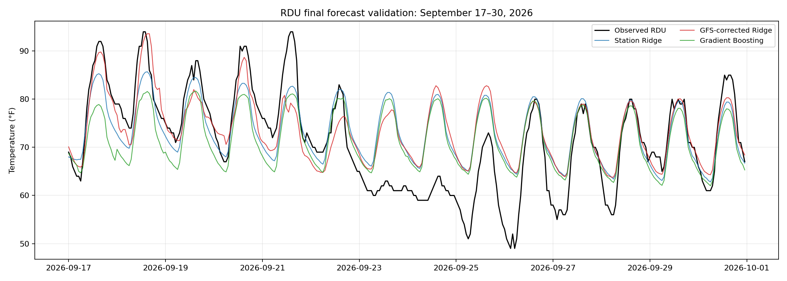

# RDU hourly temperature forecasting — Project 1

This repository contains the complete data preparation, exploratory analysis, fitted forecasting approaches, historical evaluation and final evaluation for **336 hourly RDU airport temperatures, September 17–30, 2026**. The submitted forecast is **GFS-corrected Ridge**; station Ridge and gradient boosting are retained as evaluated alternatives. The required linear and nonlinear model types are implemented. Graded slides and the 2–4 page writeup are separate student-authored deliverables.

## Goal and information cutoff

Predict the routine airport temperature report representing each hour from **September 17, 2026 00:00 through September 30 23:00, Raleigh time**. Reports usually occur at **:51**; their actual timestamps are retained. This accepted project convention is not an exact clock-hour reading or an hourly average. All temperatures and error metrics use **Fahrenheit**.

September is EDT (UTC−4). The exclusive model-input cutoff is **September 17 04:00 UTC**, and the last hour label is **October 1 03:00 UTC**. Every approach predicts the whole fortnight once. Actual target-period weather is never used to update later-hour predictions. These are retrospectively simulated forecasts under that cutoff, not a claim of real-time September issuance. [Assignment requirements](docs/PROJECT_REQUIREMENTS.md), [data contract](docs/data_contract.json).

## Final results and submitted file

All candidates were scored against the same **336 actual routine reports**, after the submitted choice had been recorded. These are final September 2026 errors, distinct from the historical practice scores below.

| Approach | MAE, °F | RMSE, °F | Bias, °F |
|---|---:|---:|---:|
| **GFS-corrected Ridge — submitted** | 5.393 | 7.200 | +2.284 |
| Station Ridge | 5.578 | 7.257 | +1.857 |
| Gradient boosting | 6.369 | 7.761 | +0.146 |
| Historical-average climatology | 6.288 | 7.682 | +0.182 |
| Raw GFS | 6.366 | 7.824 | -0.313 |

MAE measures average absolute error; RMSE emphasizes larger misses; signed bias is prediction minus observation. Small bias can hide compensating warm/cold errors. One fortnight cannot establish universal superiority. [Computed final report](reports/final/FINAL_VALIDATION_REPORT.md), [score rows](reports/final/final_validation_scores.csv), [per-day errors](reports/final/final_validation_by_day.csv), [day/night errors](reports/final/final_validation_day_night.csv).

The **[final prediction CSV](reports/final/final_forecast_336h.csv)** has 336 ordered local/UTC timestamps. `submitted_forecast_f` equals `gfs_ridge_f`. Other columns are `station_ridge_f`, `gradient_boosting_f`, `climatology_f` and `raw_gfs_f`. `lead_hours` is a target-hour ordinal from 1 to 336; the first label is at the origin, not one elapsed hour later. The exact pre-outcome file/version is preserved by [FORECAST_RECORD](docs/FORECAST_RECORD.json). No prediction values were changed in the reproducibility audit.



## Data selection and coverage

| Source | Role and retained coverage | Why selected / limitation |
|---|---|---|
| [Iowa Environmental Mesonet RDU routine METAR archive](https://mesonet.agron.iastate.edu/request/download.phtml?network=NC_ASOS) | All-month observations from January 1, 2011 through the exclusive cutoff; temperature, dew point, wind, pressure, rain, clouds and raw METAR | Direct airport target and recent-weather inputs. Archive QC is limited; screen against source evidence. |
| [NOAA GHCN-hourly](https://www.ncei.noaa.gov/products/global-historical-climatology-network-hourly) | 2011–2025 exact-timestamp verification and quality/source codes | Cross-check of the same underlying airport measurements, not independent sensors. |
| [NOAA 1991–2020 hourly normals](https://www.ncei.noaa.gov/products/land-based-station/us-climate-normals) | Fixed calendar/hour benchmark and final lookups | Reference context, not thirty additional training years. Published in 2021; standard-time convention adjusted for EDT. |
| [Open-Meteo single-run GFS archive](https://open-meteo.com/en/docs/single-runs-api) | 22 historical April–August 2026 runs and the September 16 18Z final run | Frozen pre-origin forecast guidance covering all 14 days. Gridded/downscaled; long-lead hourly values involve interpolation. |
| NOAA station metadata and publication headers | Site/instrument context and sampled original GFS object dates | Provenance rather than extra target rows; serving-time verification limits remain explicit. |
| IEM final-period observation snapshot | September 17 04:00 through October 1 04:00 UTC, evaluation only | Separate [raw CSV](reports/final/iem_rdu_final_actuals.csv) with METAR text and [request/checksum manifest](reports/final/final_observation_manifest.json). Never enters training. |

Daily products cannot meet an hourly target. Reanalysis and NASA POWER estimate grid values rather than direct airport truth. Meteostat may interpolate/fill; LCD largely duplicates NOAA; nearby airports are different targets. Shorter-horizon alternatives do not supply the entire fortnight without additional modeling. This was a practical source comparison, not a claim to have searched every possible dataset. [Full source decisions and acquisition details](docs/DATA_DECISIONS.md).

**Why download from 2011?** A ten-year practice forecast beginning in 2021 needs observations from 2011. Download coverage is wider than the final fit. Continuous all-month storage supports proper elapsed-time lags, calendar references and both history-length choices; it does not mean every model learns indiscriminately from winter and summer forecast starts.

**Selected histories:** station Ridge uses a rolling ten-year archive and simulated training starts in August–October. Its final history begins September 17, 2016 and ends at the 2026 cutoff; all-month history supplies the normal table and recent summaries. Boosting uses five years with two years of warm-up and seasonal simulated starts. GFS regression calibrates against earlier complete 2026 forecast windows, using the ten-year station reference. A training fortnight may extend beyond its starting month.

Five versus ten years and seasonal choices were tested on historical forecasts. Longer history gives a more stable reference; shorter history may better reflect recent conditions but has fewer weather episodes. Climate context motivated this comparison; it did not justify an invented 2016 climate break, automatic warming offset or deletion of real extremes. [Verified selection rationale and tradeoffs](docs/MODEL_AUDIT.md).

## Preparation and exploratory analysis

1. Retain raw downloads, request manifests, METAR text and source metadata.
2. Select routine reports consistently; preserve actual times and build a continuous UTC hourly grid.
3. Convert units, check duplicate/off-schedule reports, and match NOAA reports at exact timestamps.
4. Keep unavailable/disputed temperatures unavailable rather than interpolate them. Preserve rain traces, cloud reporting meaning and wind missingness; measured calm is zero, unknown wind direction is not north.
5. Construct Raleigh calendar features and elapsed UTC lags without stitching separate seasonal blocks together.
6. Explore only the original EDA scope and separate permitted 2026 context; fit/evaluate subsequent models under their own chronological boundaries.

The training archive has **137,711 hourly slots**. Core EDA has **93,712 usable temperatures**, 175 unavailable/quarantined temperatures, a longest unavailable run of 12 hours and 37 archive disagreements. Daily/seasonal cycles, weather variability, recent departures, source precision and missingness motivate calendar references, recent-weather features and whole-fortnight evaluation. Same-hour descriptive correlations do not permit using future observed humidity, wind or temperature as inputs.

The original EDA ends September 17, 2021; full-year comparisons use 2011–2020. The implemented development schedule starts August 27, 2021, so some early development windows overlap EDA. The 2024–2025 confirmation period remains outside it. Do not describe all development data as untouched. [Complete 24-figure EDA report](reports/eda/EDA_REPORT.md), [HTML report](reports/eda/EDA_REPORT.html), [executed notebook](notebooks/01_rdu_eda.ipynb), [numeric tables](reports/eda/tables), [dictionary](docs/DATA_DICTIONARY.md), [preparation audit](docs/PREPARATION_QUALITY_REPORT.md).

## What the three approaches learn

| Candidate | Inputs and fitted relationship |
|---|---|
| **Station Ridge** | Historical typical temperature plus a learned departure from recent temperature, pressure, humidity, wind, clouds/rain. Ridge regularizes the weights; lead-time interactions let influence change with distance ahead. Ten-year history, Aug–Oct starts, alpha=10000. |
| **Gradient boosting** | HistGradientBoostingRegressor, not XGBoost. Five-year history; an equal-weight average of two locked tree configurations predicts departures using calendar, lead and pre-origin weather. A 120-hour decay shrinks departures toward the historical reference. |
| **GFS-corrected Ridge** | A separate regression using raw GFS departures, recent airport temperature conditions, hour and lead. Alpha=10; at least six completed earlier runs. It does not consume station Ridge's predictions. |

All output actual temperature in °F. GFS is an outside physics-based forecast input, not gradient boosting. Ridge's reference is fitted from the whole outer-training history; it is not separately reconstructed before each internal simulated start. Boosting uses pre-start references. Both exclude outer-test/final outcomes. GFS clock-hour temperatures are explicitly predictors of the :51 report; the raw-GFS baseline retains that time difference. [Full audit closure, reference policy and availability limits](docs/MODEL_AUDIT.md).

## Historical evaluation and model selection

Development has 21 forecasts: seven seasonal starts in each of 2021–2023. Locked station confirmation has 14 starts in 2024–2025. Each forecast starts at local midnight, predicts 336 labels, and uses only earlier history. Models receive future calendar/lead information, not actual target temperatures. Missing/quarantined targets are excluded on a shared comparison mask. Scores average per-origin errors; weekly windows overlap and are not independent samples.

| Historical cohort | Station Ridge MAE | Boosting MAE | GFS-corrected Ridge MAE |
|---|---:|---:|---:|
| 2024–2025 station confirmation | 5.058°F | 5.470°F | No matching downloaded GFS archive |
| Four August 2026 rolling forecasts | 4.55°F | Not evaluated in this cohort | 3.42°F |

Do not compare columns across different cohorts as matched evidence. The August three-way comparison was not completed before final evaluation; it is not claimed as a selection result. GFS rolling training can use completed earlier August windows at later origins; it is not a permanently isolated August dataset. The original EDA's April–July-only, timestamp-interpolated raw-GFS diagnostic is a different analysis.

Station Ridge's selected setting was not the strict development MAE minimum: 4.700°F versus 4.664°F for the best five-year alternative. The teammate reports preferring lower warm bias and a more stable ten-year reference, treating the small difference as a practical tie. Saved numbers support that tradeoff; overlapping-origin standard errors are not a formal equivalence test. On the two exact September 17 confirmation starts, station Ridge MAE is 5.262°F and boosting 5.946°F, versus 5.055°F for ten-year climatology. Retain this limitation alongside broader seasonal scores.

The submitted choice was recorded before the final-validation commit. Final outcomes are used to measure accuracy, not to choose new settings or a hindsight hybrid. [Boosting development report](reports/models/boosting_development_report.md), [linear tuning table](reports/models/tuning_linear.csv), [linear confirmation predictions](reports/models/confirm_predictions_linear.csv), [GFS rolling scores](reports/models/gfs_2026_scores.csv).

## Reproduce the final project

Use **Python 3.12**. Commands below install the fully resolved dependency lock, restore verified data, rerun all tests, regenerate the unchanged forecasts, and score them using bundled actuals. Only package installation needs network access; final data and model inputs are saved locally.

```sh
python -m venv .venv
source .venv/bin/activate
python -m pip install -r requirements-lock.txt
python scripts/unpack_data.py
python -m unittest discover -s tests -v
python scripts/final_forecast.py
python scripts/validate_final_forecast.py
python scripts/build_documentation.py
python scripts/audit_repository.py
```

`requirements.txt` records direct dependencies; `requirements-lock.txt` records the resolved environment used for the clean run. The final scorer verifies the frozen forecast hash, exact local/UTC labels, all finite predictions and the observation snapshot hash. It needs no external `--actuals` path. An explicit alternative is supported, but never used as model input. `python scripts/download_final_actuals.py` verifies the saved input without network; `--refresh` intentionally re-downloads a mutable archive.

Optional reproductions:

```sh
python scripts/run_eda.py
python scripts/build_notebook.py
python scripts/confirm_linear.py
python scripts/confirm_boosting.py
python scripts/run_gfs.py
```

Historical development/tuning runners are retained under scripts. Do not use confirmation or final errors to tune again. Pixel bytes can depend on fonts/plotting platforms; compare numeric tables and predictions for scientific reproducibility. [Clean-run evidence](reports/REPRODUCIBILITY.json), [completion audit](reports/COMPLETION_AUDIT.json).

## Structure and retained files

| Location | Contents |
|---|---|
| `data/snapshots/` | Three immutable ZIPs containing all 97 original preparation members, including 96 checksummed files and their manifest |
| `docs/` | Current requirements, contracts, source decisions, dictionary, model audit and frozen forecast record |
| `src/` | Data loading, EDA, models, shared historical evaluation and separate final evaluation checks |
| `scripts/` | Acquisition verification, unpacking, fixed-model prediction, historical/final evaluation and report/audit generation |
| `tests/` | Time, leakage, forecast-integrity and evaluation contracts |
| `notebooks/`, `reports/eda/` | Executed EDA, figures and numeric evidence |
| `reports/models/` | Historical settings, selected evaluations and retained experiment evidence |
| `reports/final/` | Forecasts, evaluation-only raw actuals/provenance, comparisons, errors and plot |
| `reports/FILE_INVENTORY.csv`, `reports/SHA256SUMS.txt` | Current file inventory and checksums, including bundled members |

The ignored extracted `data/pre_eda/` duplicates the saved ZIP content; it is not missing data. Environments, caches and Git internals are not deliverables. The preserved final observation download is a new retrieval that exactly matched the committed evaluation, not the teammate's unretained original file. Archived values can be revised. Historical GFS API serving times and every publication time were not individually verified; retained evidence and limits are explicit. The original PowerPoint is not republished; its requirements were rechecked and documented.

The code/modeling work is complete once the clean-run audit passes. The student-authored presentation, writeup and course submission remain separate. [Current completion checklist](docs/NEXT_STEPS.md).
