# RDU exploratory analysis: working notes, not the graded writeup

The goal is a **single fixed-origin forecast of 336 hourly RDU temperatures**, issued at September 17, 2026, 00:00 Raleigh civil time, covering September 17–30. September is **EDT (UTC−4)**, not fixed EST. The cutoff is September 17 04:00 UTC; the last required label is October 1 03:00 UTC. No observations from the final window are loaded. Forecast values valid in that window are permitted only when from a pre-cutoff issuance.

The deck permits any pre-origin inputs and requires linear regression plus at least one other model. This EDA is the original model-design analysis. The repository now also contains fitted models, final predictions and separate final evaluation; this EDA does not read final outcomes. The deck says the graded writing and slides must be the student's own. These are transparent working notes and evidence for that work.

**Accepted target convention:** routine airport reports, usually at :51, represent their clock-hour labels in Fahrenheit, as agreed by the user. This is not an exact clock-hour reading or hourly mean. The fitted GFS correction uses clock-hour forecast values as predictors of the routine-report target; its raw-GFS benchmark retains this timing difference.

**Scopes:** Original EDA ends before September 17, 2021, and full-year comparisons use 2011–2020. The implemented development schedule starts August 27, 2021, so some early development windows overlap this EDA; do not describe the whole development cohort as untouched. The 2024–2025 confirmation period remains outside this EDA. A separate 2026 section describes observations already known before the final origin. GFS diagnostics use April–July calibration runs only; August confirmation outcomes remain untouched. General preparation QC can identify missingness/source conflicts in the reserved periods, but does not select a model from their weather patterns.

**Sources and coverage:** IEM routine RDU METAR observations supply the airport target and observed covariates; NOAA GHCNh cross-checks exact timestamps and quality codes through 2025, using the same underlying airport reports. This is archive verification, not independent sensor replication. The 1991–2020 NOAA hourly normals are a fixed climatology benchmark, available from 2021 and mapped using local standard time. Open-Meteo's explicitly frozen GFS single runs supply future weather guidance and a separate 2026 calibration dataset. The full reasoning, discarded alternatives, station history and environmental context are in [DATA_DECISIONS](../../docs/DATA_DECISIONS.md); provenance and original acquisition code are in the data snapshots.

**History and season choice:** Extract continuous all-month observations from 2011 to the exclusive 2026 cutoff. 2011 is needed to test a ten-year history at the 2021 origin; it is not the proposed start of the final fit. The final initial candidate is Aug–Oct 2016–2025 plus Aug 1–Sep 16, 2026, with a five-year alternative and September-only/all-month alternatives tested later. Ten years offer more weather episodes; five years may better represent the recent climate but estimate rare situations less reliably. Aug–Oct matches the autumn transition better than pooling all seasons without adjustment, while providing more examples than September alone. **EDA does not prove this is optimal:** matched-origin September forecasting errors must choose the final configuration.

**Environmental reasoning:** NOAA station history places ASOS commissioning in February 1996 and records no subsequent site move since commissioning; older rain-gauge/shield changes and a 2018 obstruction do not establish a temperature break at 2016. Metadata corrections are not automatically relocations. Regional warming motivates recency comparisons, especially nights; ten annual observations cannot attribute a trend to warming, urbanization, instrument change, or ENSO. Real weather extremes and Florence-era observations stay in the sample unless separately supported quality evidence requires quarantine. No arbitrary warming offset is applied.

**Preparation and feature rules:** Missing values and disputed targets stay flagged; no temperature interpolation/imputation is performed. UTC keeps elapsed lags correct across DST and gaps; local time defines calendar features. Wind direction is circular and represented as components where measured speed/direction permit; measured calm is zero, unknown direction remains unknown. Trace precipitation is retained separately. Blank higher cloud layers do not mean sensor failure. Same-hour METAR temperature is another representation of the target and is prohibited as a predictor. Future actual dew point, humidity, clouds, pressure, rain, wind, and future temperature lags are prohibited; use origin-known summaries or frozen forecast covariates instead. Any later imputation, scaling, feature selection or calibration is fitted inside each training fold.

**Evaluation contract used by the subsequent models:** Simulate one 336-hour forecast at each September origin. Primary MAE, secondary RMSE and signed bias, all in °F, reported with scored counts, per year/day and days 1–3, 4–7, 8–14/day/night. Compare identical masks. Report baseline errors and skill relative to climatology/persistence where appropriate. Do not use random hourly splits, training R², or temperature MAPE to claim forecast quality. Weekly GFS windows overlap; use per-origin summaries and explicit overlap when quantifying uncertainty. GFS 2026 calibration results and station-only 2021–2025 errors are different evaluation cohorts and cannot rank models against each other without matched origins.

The diagnostic methods follow [Forecasting: Principles and Practice on exploratory graphics](https://otexts.com/fpp3/graphics.html), [autocorrelation](https://otexts.com/fpp3/acf.html), and [rolling-origin evaluation](https://otexts.com/fpp3/tscv.html). NOAA documents the normals' [local-standard-time convention](https://www.ncei.noaa.gov/pub/data/cdo/documentation/normals-hourly-1991-2020_documentation.pdf). Figures report weather dispersion rather than unsupported forecast uncertainty.

## Diagnostic findings and their consequences

### The annual temperature cycle dominates the history

**Question:** What patterns must a model represent?

**Data:** 2011 through September 16, 2021, before the first development origin.

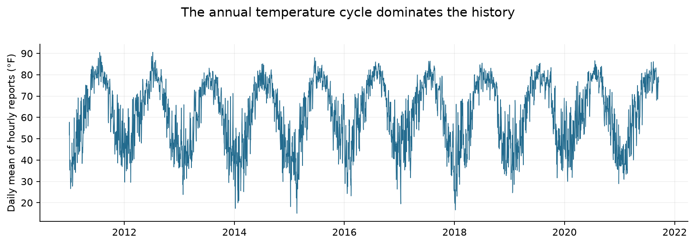

**Finding:** 93,887 expected hourly slots; 93,712 usable temperatures. Warm and cold seasons repeat, with substantial daily variation.

**Decision/implication:** Use calendar and hour features. Compare training seasons using matched September backtests.

**Limits:** Daily means describe hourly reports, not continuous daily extrema. Partial 2021 is not compared as a complete year.

### Quality exclusions and missing observations

**Question:** Are there gaps that affect lags, fitting, or scoring?

**Data:** Training scope only; absent or quarantined targets counted as unavailable.

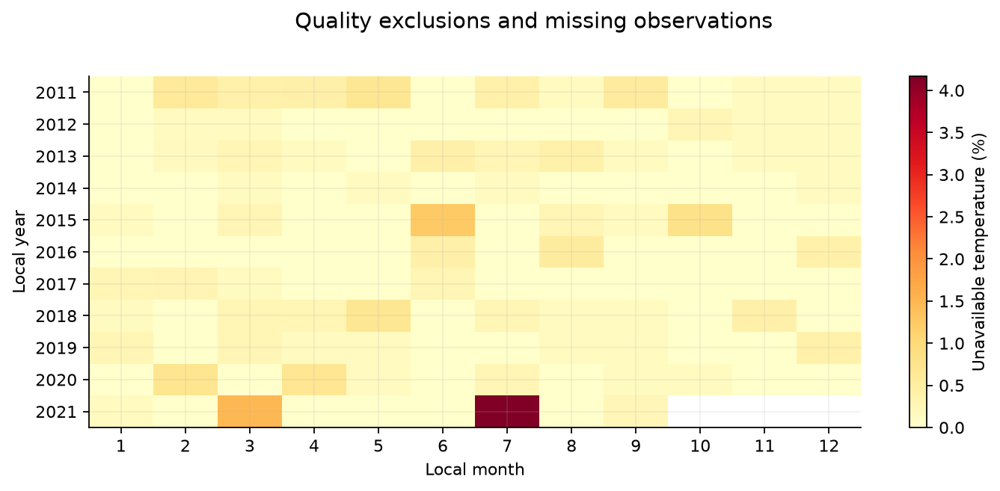

**Finding:** 175 unavailable hours (0.186%); longest consecutive run is 12 hours.

**Decision/implication:** Keep the hourly grid, retain quality flags, and score only available targets on a shared mask.

**Limits:** Gray/empty cells after the 2021 cutoff were not analyzed; unavailable includes source disagreements, not just absent reports.

### All months provide more examples, but different temperature regimes

**Question:** Why not choose all months purely because there are more rows?

**Data:** Complete training years 2011–2020; RDU routine reports; screened temperature in °F.

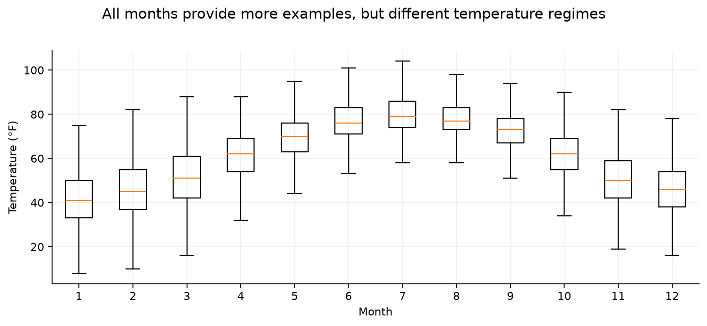

**Finding:** September mean is 72.5°F; January 41.6°F and July 80.1°F.

**Decision/implication:** Aug–Oct is the initial candidate because it brackets September. Retain all months to test whether season-aware modeling improves September errors.

**Limits:** Boxes show quartiles and whiskers; hidden outlier markers are retained in data. Row count does not equal independent weather episodes.

### The target fortnight sits within a changing autumn distribution

**Question:** How representative are neighboring months?

**Data:** Complete training years 2011–2020; RDU routine reports; screened temperature in °F.

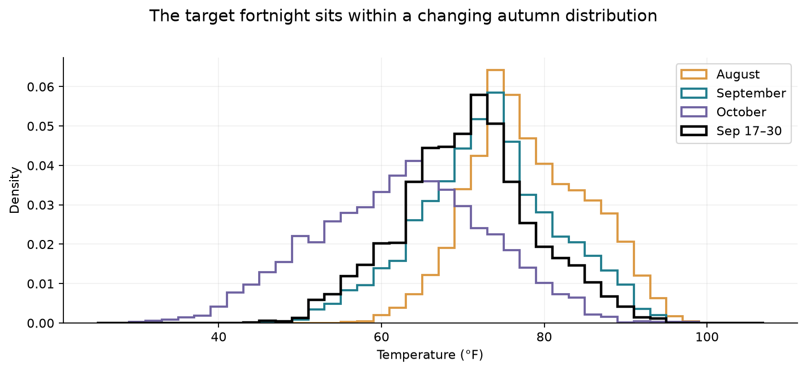

**Finding:** Historical target-window median 70.0°F; middle 80% spans 59.0–81.0°F.

**Decision/implication:** Neighboring months add examples of fronts and daily cycles, but month/day features must represent the autumn cooling.

**Limits:** These are descriptive historical quantiles, not calibrated forecast intervals for 2026.

### The daily cycle changes with season

**Question:** Should hour and season interact?

**Data:** Complete training years 2011–2020; RDU routine reports; screened temperature in °F.

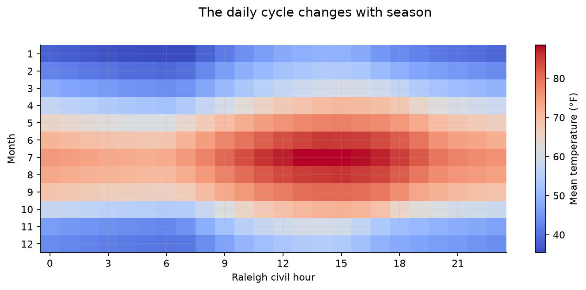

**Finding:** The warmest average hours occur in the afternoon; nights and mornings are cooler. Seasonal means and daily ranges differ.

**Decision/implication:** Use cyclic hour/day-of-year features and consider hour-by-season interactions in linear regression.

**Limits:** Civil-hour grouping respects DST; it is not an elapsed-time lag. Means conceal cloudy, wet, and frontal regimes.

### Weather variation is wider than the average daily cycle

**Question:** How much variation does a calendar-only forecast miss?

**Data:** Complete training years 2011–2020; RDU routine reports; screened temperature in °F.

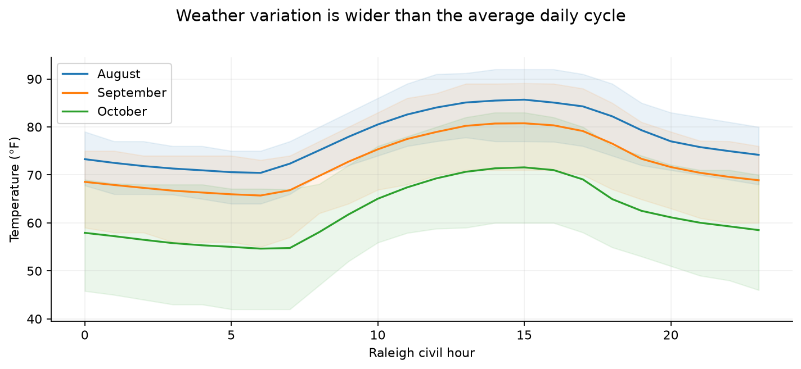

**Finding:** September mean cycle range is 15.1°F, peaking at civil hour 15.

**Decision/implication:** Calendar averages are useful baselines; forecast weather inputs may explain departures.

**Limits:** Shaded 10th–90th percentiles are weather dispersion, not uncertainty in the mean or forecast coverage.

### The forecast window is part of an autumn cooling transition

**Question:** Is September interchangeable with August and October?

**Data:** Complete training years 2011–2020; RDU routine reports; screened temperature in °F.

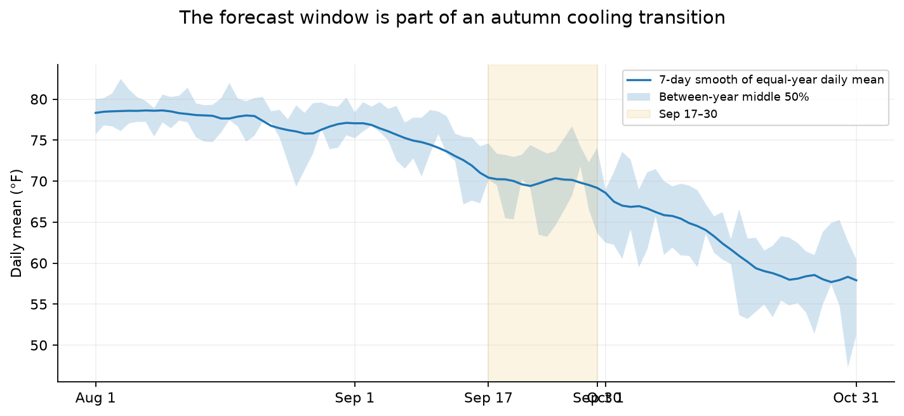

**Finding:** Average temperature declines through the candidate season; individual years depart considerably from that pattern.

**Decision/implication:** Use continuous calendar features rather than assigning one September constant.

**Limits:** Smoothing is descriptive and uses neighboring training days; it is not a forecast and is not applied across evaluation cutoffs.

### Ten historical Septembers show different two-week weather paths

**Question:** How variable is the exact target fortnight?

**Data:** Complete training years 2011–2020; RDU routine reports; screened temperature in °F.

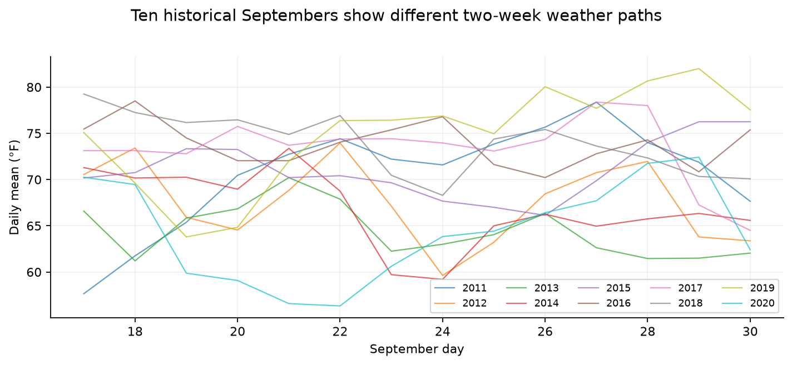

**Finding:** 3,355 usable target-like hours represent only ten annual fortnights.

**Decision/implication:** Validate whole 336-hour forecasts at historical origins; random hourly splitting would share weather events across train and test.

**Limits:** Training-era examples are descriptive; 2021–2025 evaluation fortnight outcomes are not plotted here.

### Year-to-year weather complicates a short-record warming estimate

**Question:** How should environmental change affect history selection?

**Data:** Complete training years 2011–2020; RDU routine reports; screened temperature in °F.

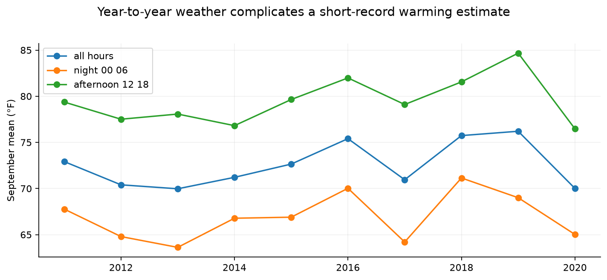

**Finding:** The descriptive September slope is +2.74°F/decade (slope SE 2.69); only ten yearly means support it.

**Decision/implication:** Compare five- and ten-year histories on matched September folds. Do not select a start year as an assumed climate break or add an arbitrary warming correction.

**Limits:** Night/afternoon groups are proxies, not observed daily minima/maxima. Ten years cannot isolate global warming, urban development, station changes, or circulation effects.

### History length changes the estimated seasonal baseline

**Question:** Does using less history visibly change the baseline?

**Data:** Complete training years 2011–2020; RDU routine reports; screened temperature in °F.

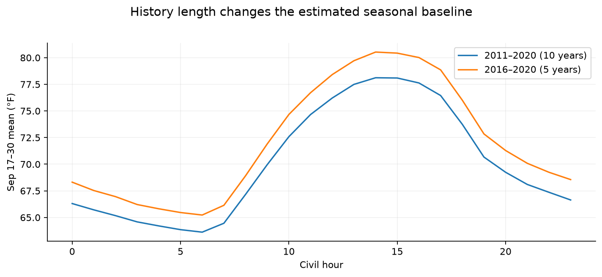

**Finding:** Five- vs ten-year target-window hourly means differ by 1.99°F on average in absolute value.

**Decision/implication:** This motivates a backtest comparison; it does not establish which window forecasts better.

**Limits:** This is the 2021-origin comparison. The final 2026 ten-year candidate is 2016–2025; its optimality has not been established.

### Recent temperatures are informative, but dependence changes with horizon

**Question:** How far does recent-weather dependence persist?

**Data:** Core pre-2021-origin history; both ends of each pair must fall in Aug–Oct.

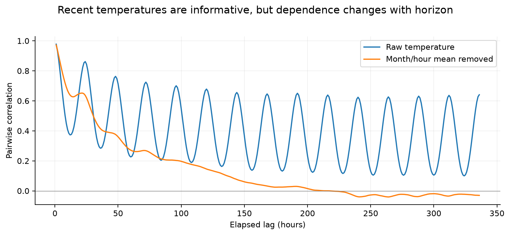

**Finding:** Calendar-demeaned lag correlations: 24h 0.64; 168h 0.03; 336h -0.03.

**Decision/implication:** At a fixed origin, future lags must be recursively predicted or replaced by origin-known summaries. Never feed observed target-window lags into later forecast hours.

**Limits:** These pairwise descriptive correlations are not forecast skill. Calendar means are calculated in the same training sample; no significance bands assume independent hours.

### Same-hour weather relationships require an availability check

**Question:** Which variables relate to temperature, and can they be used?

**Data:** Complete training years 2011–2020; RDU routine reports; screened temperature in °F. Aug–Oct only.

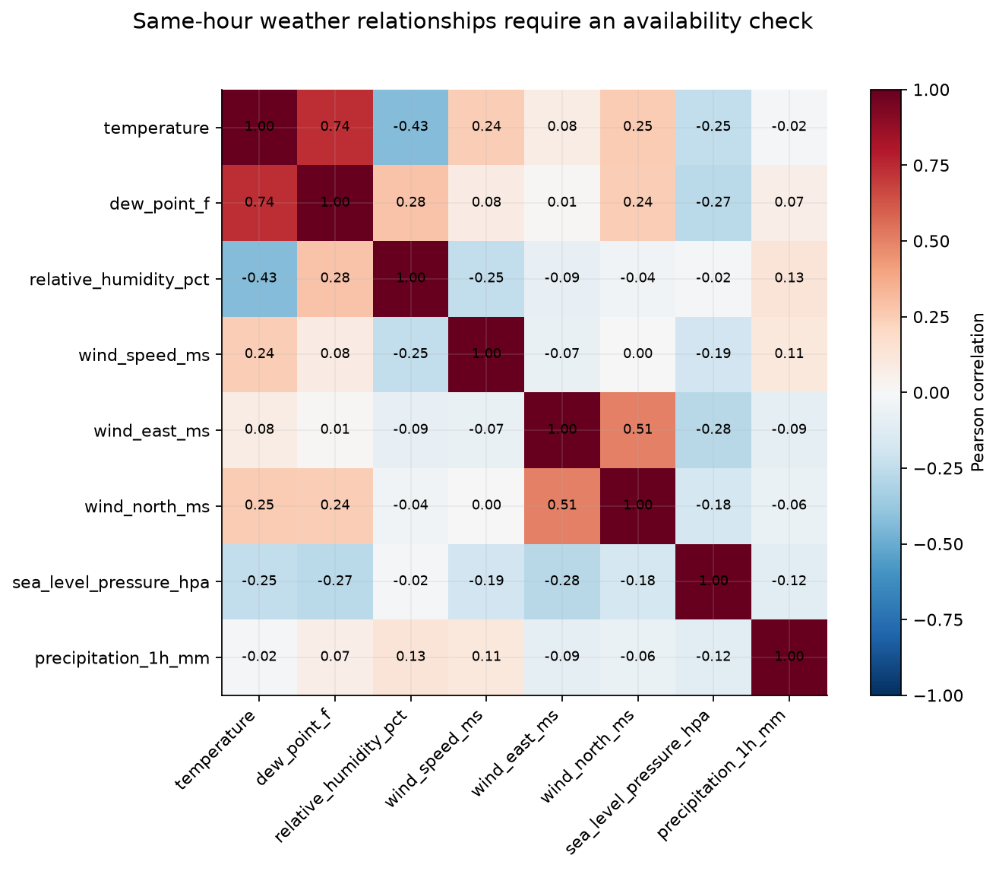

**Finding:** Temperature/dew-point correlation is 0.74; temperature/RH -0.43.

**Decision/implication:** Use observations only as origin-known summaries. Future weather features must come from frozen pre-origin forecasts; RH is also mathematically related to temperature and dew point.

**Limits:** Associations combine daily/seasonal cycles and weather effects; they are not causal effects or evidence of incremental predictive value.

### Observation fields have different completeness and meanings

**Question:** What cleaning is needed before feature engineering?

**Data:** Complete training years 2011–2020; RDU routine reports; screened temperature in °F. Aug–Oct only.

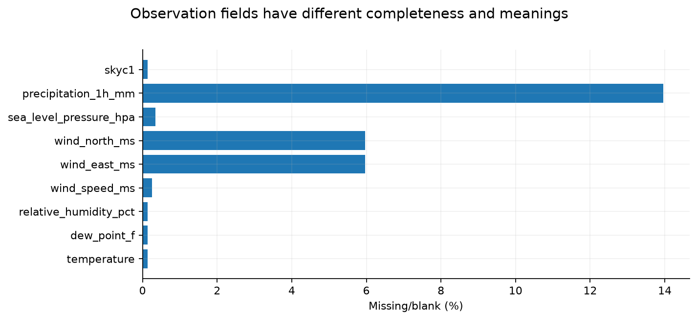

**Finding:** Availability varies by field; target screening and covariate missingness have different causes.

**Decision/implication:** Fit any imputation only on each training fold; retain trace-rain and variable-wind flags. Do not fill missing wind direction with north or empty cloud layers with an invented cloud amount.

**Limits:** Numeric precipitation blanks may mean no reported amount, not confirmed zero. Some calm METARs have blank parsed speed; preserve originals pending explicit parsing rules.

### Observed inputs have a horizon-dependent relationship with temperature

**Question:** Do same-hour relationships persist for a two-week forecast?

**Data:** Core Aug–Oct pairs; temperature has training month/hour mean removed.

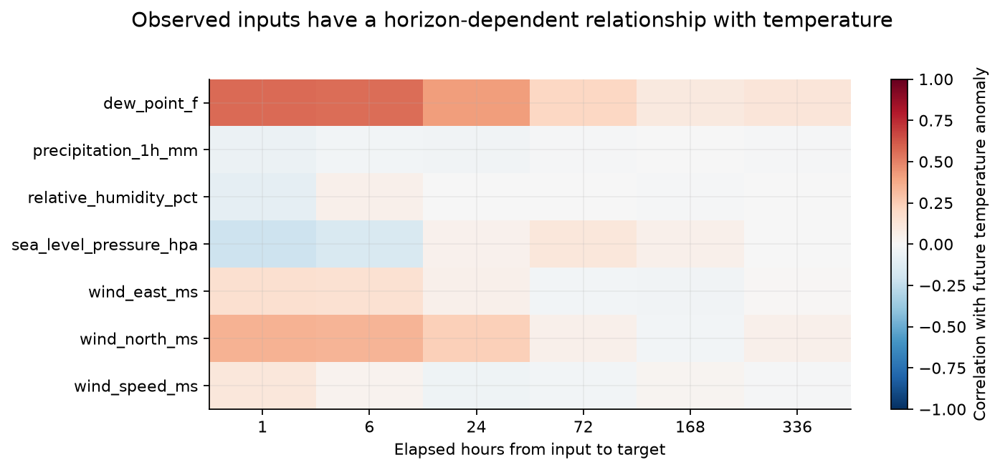

**Finding:** The table reports exact-time associations at 1, 6, 24, 72, 168 and 336 hours, with the number of available pairs.

**Decision/implication:** Test origin-known weather summaries; do not assume same-hour correlations imply 14-day usefulness.

**Limits:** Predictor calendar patterns are not removed. These associations are exploratory; only out-of-sample comparisons can establish useful features.

### Cloud categories accompany different daytime and nighttime regimes

**Question:** Should clouds be treated as a simple ordered numeric feature?

**Data:** Complete training years 2011–2020; RDU routine reports; screened temperature in °F. Aug–Oct only; first reported cloud layer.

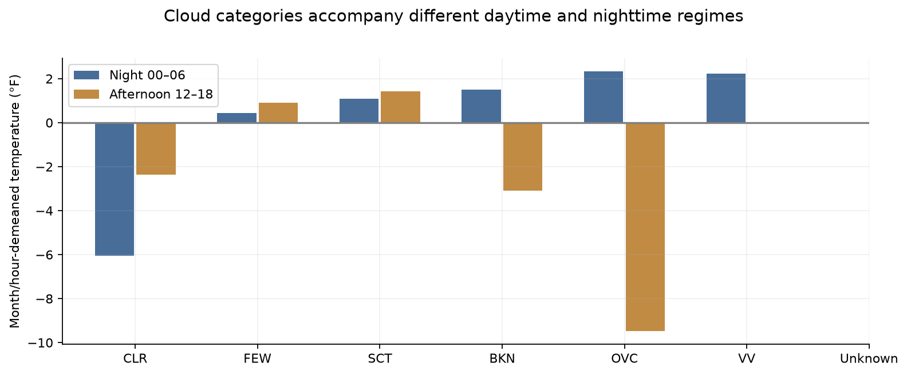

**Finding:** Mean temperature departures differ by cloud category and time of day; category sample counts are supplied.

**Decision/implication:** If used, encode observed categories explicitly; future cloud features must be forecast values, with their own representation.

**Limits:** The first layer does not measure total cloud cover. Weather regimes confound associations, and categories with small counts are unstable.

### Two archives verify the same observations; precision is a separate issue

**Question:** Do archive agreement and displayed precision justify treating all values as exact?

**Data:** Core pre-2021-origin reports; paired values only.

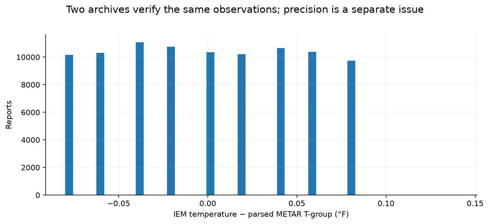

**Finding:** 93,655 IEM/T-group pairs; median absolute difference 0.040°F; 37 core targets are quarantined.

**Decision/implication:** Keep raw values, quality codes, provenance and alternate precision. Resolve target definitions before any final scoring.

**Limits:** IEM and NOAA share airport observations and are not independent sensors. Parsed T-group temperature must never be used as a predictor of the same temperature target.

### A September 2018 event illustrates a changing weather regime

**Question:** Should unusual weather be removed as an outlier?

**Data:** September 10–19, 2018, training history surrounding Hurricane Florence.

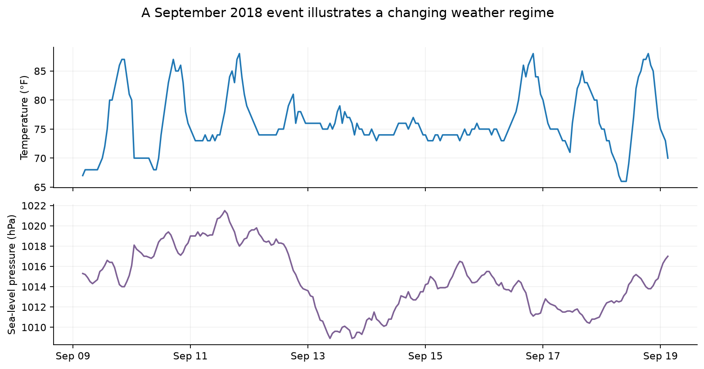

**Finding:** Temperature and pressure evolve together across this event; unusually persistent weather is part of the forecasting problem.

**Decision/implication:** Retain physically plausible extremes and events. Flag source errors separately from rare weather.

**Limits:** This plot does not attribute every fluctuation to the hurricane, and hourly samples are not true continuous extrema.

### A continuous training segment separates daily cycle and slower change

**Question:** Can daily structure be separated without filling gaps?

**Data:** Longest gap-free Aug–Oct 2020 run: 2020-09-06 04:00:00+00:00 to 2020-10-28 12:00:00+00:00; 1257 hours.

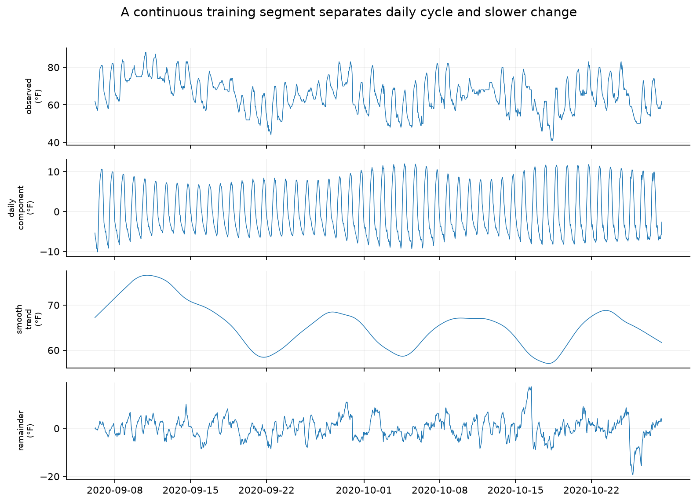

**Finding:** STL separates a repeating 24-hour component, a smooth trend, and residual weather variation.

**Decision/implication:** This supports explicit daily-cycle features; it is a descriptive diagnostic, not a fitted forecast.

**Limits:** The two-sided smoother is training-only. One segment and a chosen 24-hour period do not establish the optimal model. DST is handled in elapsed UTC hours.

### Residual dependence remains after descriptive decomposition

**Question:** Does removing a daily cycle make hours independent?

**Data:** Same 1257-hour gap-free 2020 training segment.

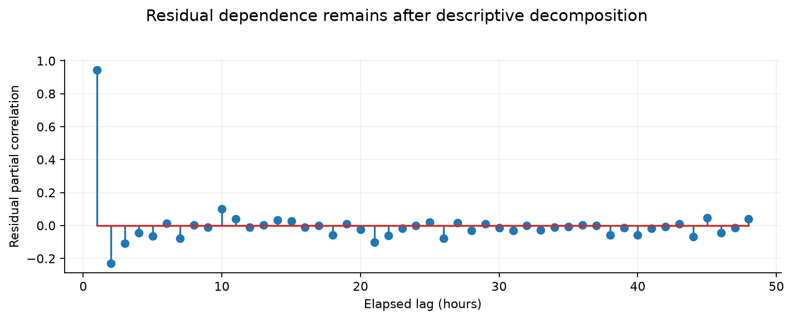

**Finding:** The PACF reports remaining short-lag dependence conditional on intermediate lags.

**Decision/implication:** Use time-respecting validation and weather-event/year-level uncertainty summaries.

**Limits:** This segment is not a model-selection test. No confidence bands are shown because iid-hour assumptions are inappropriate.

### Weather known before the final forecast origin

**Question:** What does the latest permissible station history look like?

**Data:** August 1–September 16, 2026 only; separate from the initial model-design EDA.

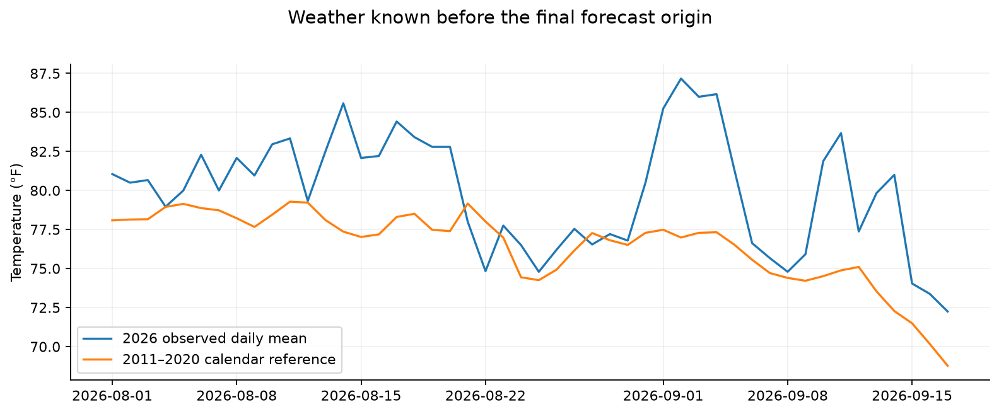

**Finding:** 1,128 known-hour slots; mean departure from the 2011–2020 calendar/hour reference is +3.45°F.

**Decision/implication:** Origin-known recent-weather summaries are candidates for later models.

**Limits:** A few weeks of weather are not evidence of a climate shift; no September 17–30, 2026 observations were accessed.

### A complete pre-origin GFS trajectory covers the required 336 hours

**Question:** Do the selected forecast and climatology sources cover every required hour?

**Data:** Forecast inputs for Sep 17 00:00–Sep 30 23:00 Raleigh civil time; no final observed outcomes.

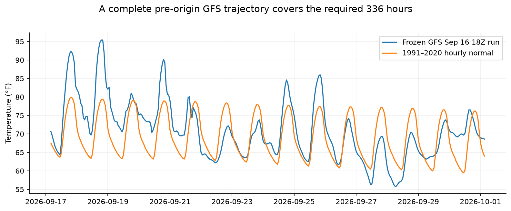

**Finding:** All 336 GFS temperature values and 336 normal lookups are present; 225 GFS target slots fall after native hourly resolution ends.

**Decision/implication:** This is a candidate forecast input/baseline, not the project prediction. Preserve issuance, lead time and interpolation flags.

**Limits:** GFS is gridded and one forecast trajectory supplies no calibrated uncertainty. Normals use local standard time (UTC−5), correctly offset from September EDT (UTC−4). Routine-report :51 scoring still needs agreed alignment.

### Frozen GFS error varies across the two-week horizon

**Question:** Is raw forecast guidance equally accurate at every lead?

**Data:** Calibration-only April 2–July 23, 2026 initializations; July 30 and August confirmation runs excluded.

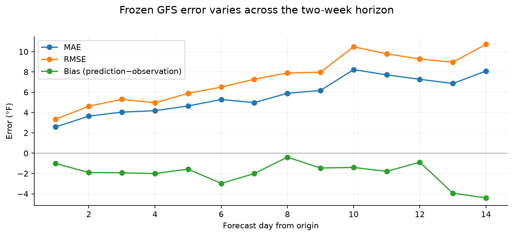

**Finding:** 17 origins; 5,700 scored forecast/report pairs. Pooled MAE 5.69°F, RMSE 7.69°F, bias -1.98°F.

**Decision/implication:** Consider lead-dependent calibration later, and compare candidates on the same origins and observation mask. This analysis fits no correction.

**Limits:** An exploratory routine-report benchmark: interpolate the same frozen run to each actual :51 report timestamp. Weekly valid windows overlap, so pairs are not independent. Spring/summer errors are not September or final-project scores. Historical API publication times were not individually logged.

### Trace rain, explicit zero and missing amounts have different meanings

**Question:** Can precipitation be reduced to a simple missing-equals-zero rule?

**Data:** Complete training years 2011–2020; RDU routine reports; screened temperature in °F. Aug–Oct only.

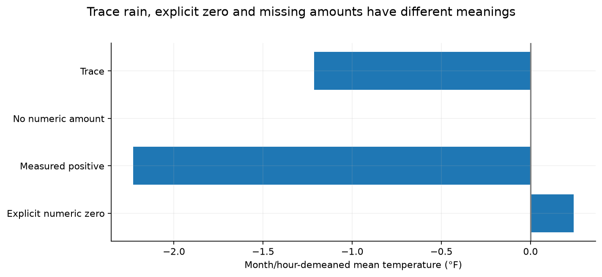

**Finding:** The table distinguishes positive measured precipitation, trace, explicit numeric zero, and no numeric amount, with counts and temperature associations.

**Decision/implication:** Retain trace and missing indicators; use rainfall as an origin-known summary or forecast input only after its reporting convention is explicit.

**Limits:** These are contemporaneous associations, not a causal rain effect or a forecast test. A missing numeric amount does not establish dry weather.

### Exact-timestamp archive comparisons separate rounding from disagreements

**Question:** How consistent is the airport temperature target across the two archives?

**Data:** Matched IEM/NOAA reports strictly before the first September 2021 origin.

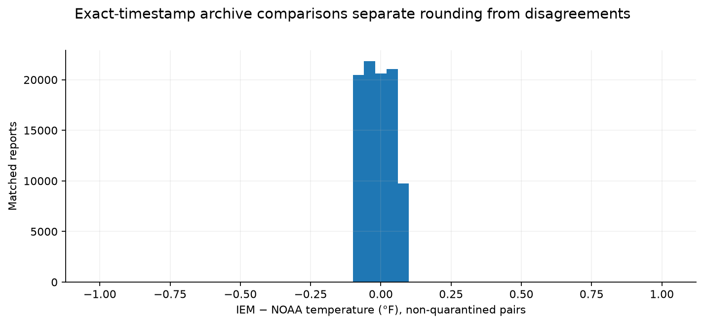

**Finding:** 93,754 matched reports; median absolute archive difference 0.040°F; 37 require review.

**Decision/implication:** Preserve source codes and match actual timestamps. Review disagreements instead of silently averaging archives or assuming displayed precision is accuracy.

**Limits:** Histogram omits quarantined pairs but their counts are reported. Both archives derive from the same station; later archive revisions cannot be proven to match what was distributed historically.

## Completion audit and remaining decisions

EDA covers source agreement/precision, target and covariate missingness, monthly and hourly seasonality, the exact September fortnight, autumn transition, annual/recency sensitivity, dependence and lagged relationships, weather covariates, cloud regimes, extremes/event context, continuous-segment decomposition, latest permissible context, normals and frozen forecast coverage, and calibration-only GFS diagnostics. Each figure has a scope, explanation and limitation; numeric tables and code accompany it.

The accepted target is the routine report in Fahrenheit. Source conflicts and missing targets remain excluded on shared historical comparison masks. The models have now been fitted and final predictions scored separately; see ../../docs/MODEL_AUDIT.md and ../final/FINAL_VALIDATION_REPORT.md. This EDA itself uses no final outcomes or August GFS confirmation errors. Model settings and selection must not be changed using final answers. Student-authored graded submissions remain separate.
